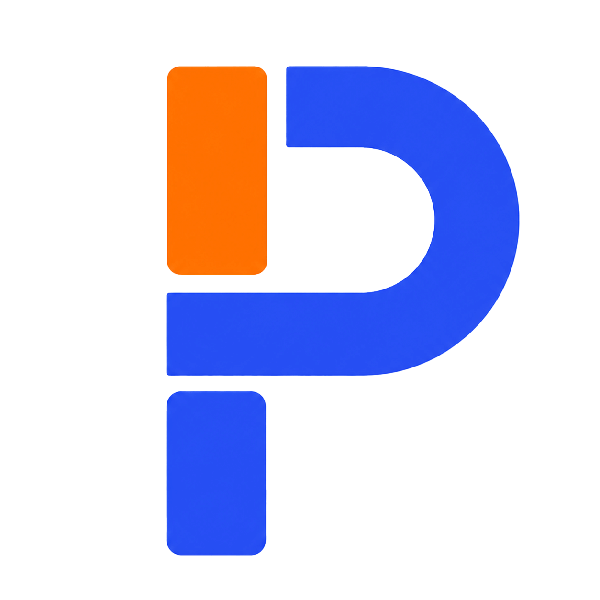

<p align="center">
  
</p>

<h1 align="center">PHENY — Stephen Wasswa | Portfolio 2026</h1>

<p align="center"><strong>Building Technology with Purpose. Leading with Excellence.</strong></p>

Personal portfolio website for **Stephen Wasswa (Pheny)** — Software Engineering student at Victoria University Kampala, Front-End Developer, Creative Technologist, and Kingdom Leader. Based in Kampala, Uganda.

---

## ✨ Overview

A modern, responsive, multi-page portfolio showcasing professional work, skills, experience, and articles. Built with **React 19**, **TypeScript**, and **Vite** for blazing-fast performance and a premium user experience.

### Live Pages

| Route        | Page       | Description                                           |
| ------------ | ---------- | ----------------------------------------------------- |
| `/`          | Home       | Hero banner, core expertise, featured projects        |
| `/about`     | About      | Bio, education, experience timeline, skills & values  |
| `/projects`  | Projects   | Full project gallery with case study modals           |
| `/articles`  | Articles   | Blog / article cards                                  |
| `/contact`   | Contact    | Contact form and social links                         |

---

## 🛠 Tech Stack

| Layer          | Technologies                                            |
| -------------- | ------------------------------------------------------- |
| **Framework**  | React 19 · TypeScript 6 · Vite 8                       |
| **Routing**    | React Router DOM v7                                     |
| **Icons**      | Lucide React                                            |
| **Effects**    | Canvas Confetti                                         |
| **Styling**    | Vanilla CSS (custom design system, Plus Jakarta Sans)   |
| **Linting**    | Oxlint                                                  |

---

## 📁 Project Structure

```
portifolio-2026/
├── public/
│   ├── icons.svg
│   └── images/
│       ├── Favicon.png      # Site favicon
│       ├── Logo.png          # Brand logo (navbar & footer)
│       └── ...               # Project screenshots & assets
├── src/
│   ├── assets/             # Static assets (hero image, SVGs)
│   ├── components/         # Reusable UI components
│   │   ├── ArticleCard.tsx
│   │   ├── CaseStudyModal.tsx
│   │   ├── Footer.tsx
│   │   ├── Navbar.tsx
│   │   └── ProjectCard.tsx
│   ├── data/               # Typed data sources
│   │   ├── articles.ts
│   │   ├── experience.ts
│   │   ├── projects.ts
│   │   ├── skills.ts
│   │   └── socialLinks.ts
│   ├── pages/              # Route-level page components
│   │   ├── AboutPage.tsx
│   │   ├── ArticlesPage.tsx
│   │   ├── ContactPage.tsx
│   │   ├── HomePage.tsx
│   │   └── ProjectsPage.tsx
│   ├── App.tsx             # Root layout, routing, scroll-to-top
│   ├── App.css
│   ├── index.css           # Design system & global styles
│   └── main.tsx            # Entry point
├── index.html
├── package.json
├── vite.config.ts
└── tsconfig.json
```

---

## 🚀 Getting Started

### Prerequisites

- **Node.js** ≥ 18
- **npm** ≥ 9

### Install & Run

```bash
# Clone the repository
git clone https://github.com/Wasswa-Phen/profile.git
cd profile

# Install dependencies
npm install

# Start the dev server
npm run dev
```

### Available Scripts

| Command             | Description                         |
| ------------------- | ----------------------------------- |
| `npm run dev`       | Start Vite dev server with HMR      |
| `npm run build`     | Type-check & build for production    |
| `npm run preview`   | Preview the production build locally |
| `npm run lint`      | Lint with Oxlint                     |

---

## 💼 Featured Projects

- **T&T Nursery & Junior School** — Full front-end build for a live school website in Kasenge, Uganda. ([tandtjuniorschool.com](https://tandtjuniorschool.com/))
- **Kasenge Miracle Centre Church Platform** — Custom digital hub with livestream integration, sermon archives, and media production workflows.
- **Aromax Technologies Uganda** — Corporate website redesign with modern React/Vite architecture and brand refresh.

---

## 🧠 Skills Covered

**Languages:** HTML5 · CSS3 · JavaScript (ES6+) · C · Java · C#
**Front-End:** React · Vite · TypeScript · Node.js · Responsive Design
**Tooling:** Git · GitHub · MySQL · VS Code
**Creative:** Adobe Photoshop · Illustrator · Figma · UI/UX Design
**Production:** Adobe Premiere Pro · DaVinci Resolve · OBS Studio · Behringer X32

---

## 🔗 Connect

[](https://www.linkedin.com/in/stephen-wasswa)
[](https://github.com/Wasswa-Phen)
[](https://x.com/wasswa_phen)
[](https://www.youtube.com/@PhenyLabs)
[](https://www.instagram.com/wasswa_phen/)

---

## 📄 License

© 2026 Stephen Wasswa. All rights reserved.
